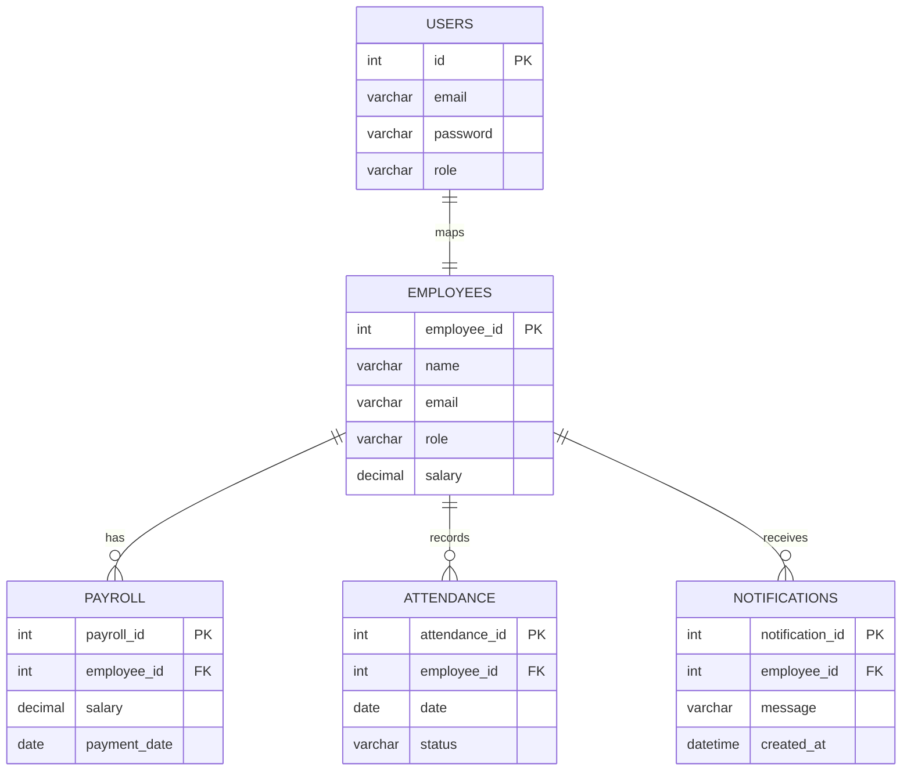

# 💼 Employee Payroll Management System (DBMS-Focused)

A **production-ready Employee Payroll Management System** designed with strong **Database Management System (DBMS) principles**, built using Node.js, Express, and MySQL.

This project emphasizes **relational database design, normalization, constraints, and efficient query handling**.

---

## 🚀 Tech Stack

Backend: Node.js, Express  
Database: MySQL 8+ 🐬 (Core Focus)  
Frontend: HTML, CSS, JavaScript  

Authentication: JWT + Bcrypt  
Security: Helmet, CORS, Rate Limiting  
Logging: Morgan  

---

## 🧠 DBMS-Centric Features

### 🗄️ Relational Database Design
- Primary Keys, Foreign Keys
- Constraints (NOT NULL, UNIQUE)
- Structured multi-table schema

### 🔗 Entity Relationships
- Employee ↔ Payroll (1:N)
- Employee ↔ Attendance (1:N)
- Employee ↔ Notifications (1:N)

### 📊 Normalization
- Designed up to **3NF**
- Removes redundancy
- Ensures data consistency

### ⚡ Efficient Queries
- JOIN operations
- Optimized salary calculation queries
- Indexed columns for faster retrieval

---

## ✨ Core Features

### 👨‍💼 Employee Management
- Add, update, delete employees

### 📅 Attendance Management
- Daily attendance tracking
- Used for payroll calculation

### 💰 Payroll System
- Salary calculation based on attendance & role
- Payroll history maintained

### 🔔 Notifications System
- Store and fetch notifications from DB

### 🔐 Authentication
- JWT-based login/register
- Password hashing using bcrypt

---

## 👥 Roles

### admin
- Full access (CRUD)
- Manage employees, payroll, attendance, notifications

### employee
- View personal data
- View payroll & attendance

---

## 🗄️ Database Schema

### Tables:
- employees  
- payroll  
- attendance  
- notifications  
- users  

---

## 📊 ER Diagram



## MySQL Connection

```
const mysql = require("mysql2");

const db = mysql.createConnection({
  host: process.env.DB_HOST,
  user: process.env.DB_USER,
  password: process.env.DB_PASSWORD,
  database: process.env.DB_NAME
});

db.connect((err) => {
  if (err) throw err;
  console.log("MySQL Connected ✅");
});

module.exports = db;

```
---

## 📂 Project Structure
```
project/
│── backend/
│   ├── routes/
│   │   ├── auth.js
│   │   ├── employees.js
│   │   ├── payroll.js
│   │   ├── attendance.js
│   │   └── notifications.js
│
├── database/
│   ├── schema.sql
│   └── notifications.sql
│
├── frontend/
│   ├── index.html
│   ├── dashboard.html
│   ├── employees.html
│   ├── payroll.html
│   ├── attendance.html
│
└── .env
```
---

## ⚙️ Environment Variables
```
DB_HOST=localhost
DB_USER=root
DB_PASSWORD=yourpassword
DB_NAME=payroll_db

PORT=5000

JWT_SECRET=your_secret_key
JWT_EXPIRES_IN=7d

NODE_ENV=development
CORS_ORIGIN=http://localhost:5000
```

---

## 🛠️ Setup

### Install Dependencies
```bash
npm install
```

### Setup Database
```sql
CREATE DATABASE payroll_db;
```

### Import Schema
```bash
/database/schema.sql
/database/notifications.sql
```

### Run Server
```bash
npm run dev
```

---

## 🔍 API Structure

**Base URL:** `/api/v1`

### 🔐 Auth
- Login
- Register  

### 👨‍💼 Employees
- CRUD Operations  

### 📅 Attendance
- Mark attendance  
- View attendance records  

### 💰 Payroll
- Generate salary  
- View payroll history  

### 🔔 Notifications
- Create and fetch notifications  

---

## 📊 Business Rules

- Only admin can modify data  
- Employees can only view their own data  
- Attendance directly affects salary  
- Foreign key constraints maintain data integrity  
- No orphan records allowed  

---

## 🔐 Default Credentials

### Admin
```txt
Email: admin@company.com
Password: admin123
```

### Employee
```txt
Email: employee@company.com
Password: emp123
```

---

## 🧪 Testing

Use Postman or any API testing tool.

### Recommended Flow:
1. Login  
2. Add Employee  
3. Mark Attendance  
4. Generate Payroll  
5. Fetch Reports  

---

## 📌 Future Enhancements

- PDF Payslip Generation  
- Advanced SQL Reports (JOIN, GROUP BY, Aggregates)  
- Cloud Deployment (AWS / GCP)  
- Mobile Responsive UI  


